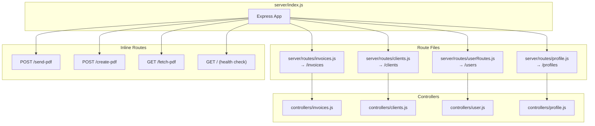

# API Endpoints & Routes

## Overview
The Accountill backend exposes REST endpoints via Express.js. Routes are split across 4 route files mounted in `server/index.js:32–35`, plus 3 inline routes defined directly in `server/index.js` for PDF operations.

---

## Route Registration Diagram


---

## Table 1: Backend API Routes

### Invoice Routes (`/invoices` — `server/routes/invoices.js:6–11`)
| Method | Path | Handler | What it does | Auth Middleware | Evidence |
|---|---|---|---|---|---|
| `GET` | `/invoices/count` | `getTotalCount` | Returns total count of invoices for a user (used for invoice serial number generation) | **None** | `routes/invoices.js:6`, `controllers/invoices.js:22–33` |
| `GET` | `/invoices/:id` | `getInvoice` | Fetch a single invoice by MongoDB `_id` | **None** | `routes/invoices.js:7`, `controllers/invoices.js:68–78` |
| `GET` | `/invoices?searchQuery=` | `getInvoicesByUser` | Fetch all invoices where `creator` matches `searchQuery` | **None** | `routes/invoices.js:8`, `controllers/invoices.js:9–19` |
| `POST` | `/invoices` | `createInvoice` | Create a new invoice from `req.body` | **None** | `routes/invoices.js:9`, `controllers/invoices.js:53–66` |
| `PATCH` | `/invoices/:id` | `updateInvoice` | Update an existing invoice. Validates ObjectId. | **None** | `routes/invoices.js:10`, `controllers/invoices.js:81–90` |
| `DELETE` | `/invoices/:id` | `deleteInvoice` | Delete an invoice. Validates ObjectId. | **None** | `routes/invoices.js:11`, `controllers/invoices.js:93–101` |

### Client Routes (`/clients` — `server/routes/clients.js:6–10`)
| Method | Path | Handler | What it does | Auth Middleware | Evidence |
|---|---|---|---|---|---|
| `GET` | `/clients?page=` | `getClients` | Paginated client list (LIMIT=8 per page). Returns `{ data, currentPage, numberOfPages }` | **None** | `routes/clients.js:6`, `controllers/clients.js:37–51` |
| `GET` | `/clients/user?searchQuery=` | `getClientsByUser` | Fetch clients where `userId` matches `searchQuery` | **None** | `routes/clients.js:7`, `controllers/clients.js:90–100` |
| `POST` | `/clients` | `createClient` | Create a new client record | **None** | `routes/clients.js:8`, `controllers/clients.js:53–65` |
| `PATCH` | `/clients/:id` | `updateClient` | Update an existing client. Validates ObjectId. | **None** | `routes/clients.js:9`, `controllers/clients.js:67–76` |
| `DELETE` | `/clients/:id` | `deleteClient` | Delete a client. Validates ObjectId. | **None** | `routes/clients.js:10`, `controllers/clients.js:79–87` |

### User Routes (`/users` — `server/routes/userRoutes.js:6–9`)
| Method | Path | Handler | What it does | Auth Middleware | Evidence |
|---|---|---|---|---|---|
| `POST` | `/users/signin` | `signin` | Authenticate user with email/password, return JWT (1h expiry) + user profile | **None** (public) | `routes/userRoutes.js:6`, `controllers/user.js:18–42` |
| `POST` | `/users/signup` | `signup` | Register new user, hash password (bcrypt 12 rounds), create JWT, auto-create profile | **None** (public) | `routes/userRoutes.js:7`, `controllers/user.js:46–68` |
| `POST` | `/users/forgot` | `forgotPassword` | Generate reset token via `crypto.randomBytes(32)`, email reset link (1h expiry) | **None** (public) | `routes/userRoutes.js:8`, `controllers/user.js:85–133` |
| `POST` | `/users/reset` | `resetPassword` | Validate reset token, hash new password, clear token | **None** (public) | `routes/userRoutes.js:9`, `controllers/user.js:137–156` |

### Profile Routes (`/profiles` — `server/routes/profile.js:6–11`)
| Method | Path | Handler | What it does | Auth Middleware | Evidence |
|---|---|---|---|---|---|
| `GET` | `/profiles/:id` | `getProfile` | Fetch a single profile by MongoDB `_id` | **None** | `routes/profile.js:6`, `controllers/profile.js:18–28` |
| `GET` | `/profiles?searchQuery=` | `getProfilesByUser` | Fetch profile where `userId` matches `searchQuery` | **None** | `routes/profile.js:8`, `controllers/profile.js:69–81` |
| `POST` | `/profiles` | `createProfile` | Create a new business profile. Rejects if email already exists. | **None** | `routes/profile.js:9`, `controllers/profile.js:30–65` |
| `PATCH` | `/profiles/:id` | `updateProfile` | Update an existing profile. Validates ObjectId. | **None** | `routes/profile.js:10`, `controllers/profile.js:101–110` |
| `DELETE` | `/profiles/:id` | `deleteProfile` | Delete a profile. Validates ObjectId. | **None** | `routes/profile.js:11`, `controllers/profile.js:113–121` |

### Inline Routes (defined in `server/index.js`)
| Method | Path | What it does | Auth Middleware | Evidence |
|---|---|---|---|---|
| `POST` | `/send-pdf` | Generate PDF from invoice data and email it to the specified address with attachment | **None** | `server/index.js:53–78` |
| `POST` | `/create-pdf` | Generate PDF from invoice data and save to disk | **None** | `server/index.js:87–94` |
| `GET` | `/fetch-pdf` | Serve the most recently generated `invoice.pdf` file | **None** | `server/index.js:97–99` |
| `GET` | `/` | Health check — returns "SERVER IS RUNNING" | **None** | `server/index.js:102–104` |

---

## Auth Middleware Analysis

The auth middleware exists at `server/middleware/auth.js` but is **never imported or used** in any route file:

```javascript
// server/middleware/auth.js:7-31
const auth = async (req, res, next) => {
    try {
        const token = req.headers.authorization.split(" ")[1]
        const isCustomAuth = token.length < 500
        let decodeData;
        if(token && isCustomAuth) {
            decodeData = jwt.verify(token, SECRET)
            req.userId = decodeData?.id
        } else {
            decodeData = jwt.decode(token)
            req.userId = decodeData?.sub
        }
        next()
    } catch (error) {
        console.log(error)
    }
}
```

**⚠️ Critical finding**: None of the 4 route files import `auth` middleware. All routes are effectively **public**. The client sends a Bearer token via the Axios interceptor (`client/src/api/index.js:6–12`), but the server never validates it on CRUD routes.

---

## Table 2: Client-Side Screens / Pages

| Route | Component | What the user does | API calls made | Evidence |
|---|---|---|---|---|
| `/` | `Home` | Landing page / home view | — | `client/src/App.js:32` |
| `/login` | `Login` | Sign in or sign up | `POST /users/signin`, `POST /users/signup` | `client/src/App.js:37` |
| `/dashboard` | `Dashboard` | View invoice stats and charts | `GET /invoices?searchQuery=` | `client/src/App.js:39` |
| `/invoice` | `Invoice` | Create a new invoice | `POST /invoices` | `client/src/App.js:33` |
| `/edit/invoice/:id` | `Invoice` | Edit an existing invoice | `GET /invoices/:id`, `PATCH /invoices/:id` | `client/src/App.js:34` |
| `/invoice/:id` | `InvoiceDetails` | View invoice detail, send PDF, record payment | `GET /invoices/:id`, `POST /send-pdf`, `POST /create-pdf`, `GET /fetch-pdf` | `client/src/App.js:35` |
| `/invoices` | `Invoices` | Browse all user's invoices | `GET /invoices?searchQuery=` | `client/src/App.js:36` |
| `/customers` | `ClientList` | Manage client records | `GET /clients/user?searchQuery=`, `POST /clients`, `PATCH /clients/:id`, `DELETE /clients/:id` | `client/src/App.js:40` |
| `/settings` | `Settings` | Edit business profile and logo | `GET /profiles?searchQuery=`, `PATCH /profiles/:id` | `client/src/App.js:38` |
| `/forgot` | `Forgot` | Request password reset email | `POST /users/forgot` | `client/src/App.js:41` |
| `/reset/:token` | `Reset` | Submit new password with reset token | `POST /users/reset` | `client/src/App.js:42` |
| `/new-invoice` | (Redirect) | Redirects to `/invoice` | — | `client/src/App.js:43` |

---

## Route Counting Summary
- **Route files**: 4 (`invoices.js`, `clients.js`, `userRoutes.js`, `profile.js`)
- **Route file handlers**: 6 + 5 + 4 + 5 = **20 handlers**
- **Inline handlers** in `index.js`: 4 (`/send-pdf`, `/create-pdf`, `/fetch-pdf`, `/`)
- **Total backend endpoints**: **24**
- **Client-side pages**: **12** (including the redirect)

Counting method: Read each route file and counted `router.get/post/patch/delete` calls, plus inline `app.get/post` calls in `server/index.js`.
