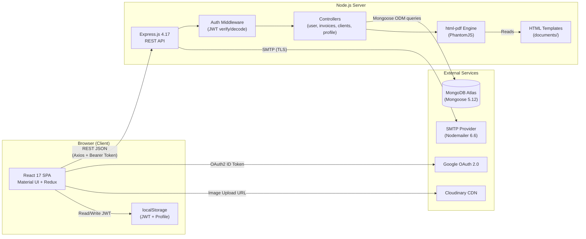
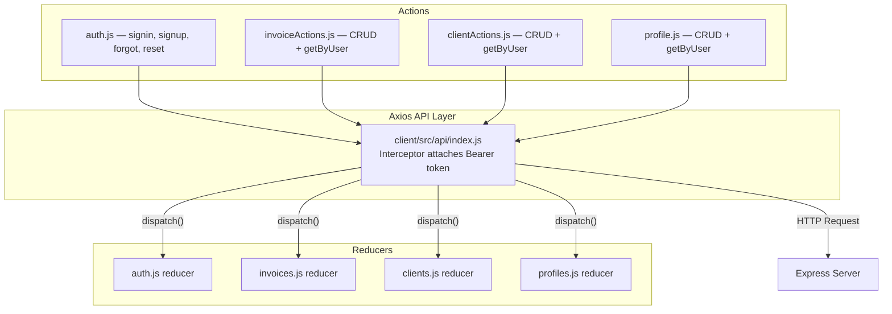
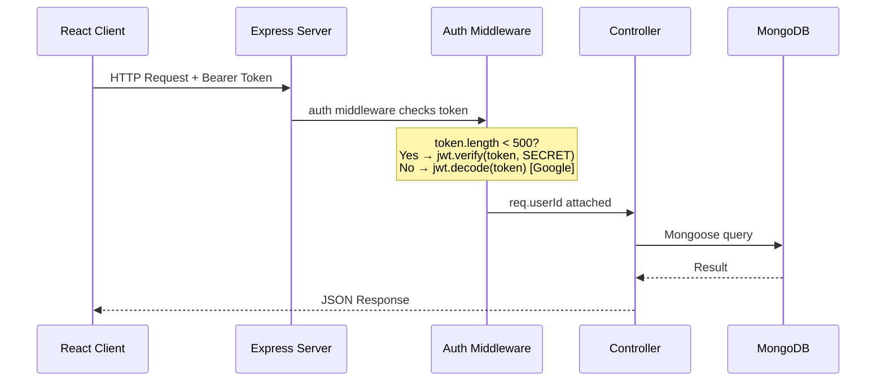
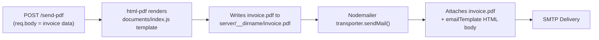

# System Architecture

## Overview
Accountill is a classic **MERN stack** (MongoDB, Express, React, Node.js) monorepo application split into two distinct deployable units: a React SPA client and an Express API server.

---

## High-Level Architecture Diagram



---

## Component Details

### 1. React Client (Frontend SPA)
| Aspect | Details | Evidence |
|---|---|---|
| **Framework** | React 17.0.2 with class/functional components | `client/package.json:25` |
| **Routing** | React Router DOM 5.2 with `<BrowserRouter>`, `<Switch>`, `<Route>` | `client/src/App.js:5,27–44` |
| **State Management** | Redux 4.1 + Redux Thunk for async actions | `client/package.json:38–39` |
| **UI Library** | Material UI 4.11.4 — components, icons, pickers, lab | `client/package.json:10–13` |
| **HTTP Client** | Axios 0.21.1 with request interceptor for JWT | `client/src/api/index.js:4,6–12` |
| **Charts** | ApexCharts 3.28.1 + Recharts 2.0.9 (payment history) | `client/package.json:18,37` |
| **Notifications** | react-simple-snackbar 1.1.11 | `client/package.json:35`, `client/src/App.js:6` |
| **File Handling** | react-dropzone 11.3.4 (logo uploads), file-saver 2.0.5 (PDF downloads) | `client/package.json:21,28` |

#### Client-Side Route Map (from `client/src/App.js:31–44`)
```
/                → Home (landing page)
/login           → Login (signin/signup forms)
/dashboard       → Dashboard (statistics + charts)
/invoice         → Invoice (create new)
/edit/invoice/:id → Invoice (edit existing)
/invoice/:id     → InvoiceDetails (view single)
/invoices        → Invoices (list all)
/customers       → ClientList (manage clients)
/settings        → Settings (business profile)
/forgot          → Forgot (password reset request)
/reset/:token    → Reset (password reset form)
/new-invoice     → Redirect → /invoice
```

#### Redux Data Flow


Evidence for Redux constants: `client/src/actions/constants.js:2–30`

### 2. Express Server (Backend API)
| Aspect | Details | Evidence |
|---|---|---|
| **Entry point** | `server/index.js` — mounts routes, configures CORS, connects MongoDB | `server/index.js:25–35` |
| **Body parsing** | JSON + URL-encoded, 30MB limit | `server/index.js:28–29` |
| **CORS** | Enabled globally via `cors()` middleware | `server/index.js:30` |
| **Routing** | 4 route files mounted at `/invoices`, `/clients`, `/users`, `/profiles` | `server/index.js:32–35` |
| **PDF routes** | Inline: `POST /send-pdf`, `POST /create-pdf`, `GET /fetch-pdf` | `server/index.js:53,87,97` |
| **Health check** | `GET /` returns "SERVER IS RUNNING" | `server/index.js:102–104` |

#### Server Request Flow


Evidence: `server/middleware/auth.js:7–31`

### 3. Authentication System

```mermaid
graph TD
    subgraph "Custom Auth (JWT)"
        S1["POST /users/signup"] --> H["bcrypt.hash(password, 12)"]
        H --> U["User.create()"]
        U --> T["jwt.sign(email, id, SECRET, 1h)"]
        
        S2["POST /users/signin"] --> F["User.findOne(email)"]
        F --> C["bcrypt.compare(password, hash)"]
        C --> T2["jwt.sign(email, id, SECRET, 1h)"]
    end

    subgraph "Google Auth"
        G1["Google OAuth Token"] --> G2["jwt.decode(token)"]
        G2 --> G3["req.userId = decoded.sub"]
    end

    subgraph "Password Reset"
        P1["POST /users/forgot"] --> P2["crypto.randomBytes(32)"]
        P2 --> P3["Save resetToken + expireToken<br/>(1 hour expiry)"]
        P3 --> P4["Nodemailer sends reset link"]
        P5["POST /users/reset"] --> P6["Find user by resetToken<br/>where expireToken > Date.now()"]
        P6 --> P7["bcrypt.hash(newPassword, 12)"]
        P7 --> P8["Clear resetToken/expireToken"]
    end
```


Evidence:
- Signup: `server/controllers/user.js:46–68`
- Signin: `server/controllers/user.js:18–42`
- Forgot: `server/controllers/user.js:85–133`
- Reset: `server/controllers/user.js:137–156`
- Auth middleware: `server/middleware/auth.js:9–25`

### 4. PDF & Email Pipeline


**Key code proof** — `server/index.js:53–78`:
```javascript
app.post('/send-pdf', (req, res) => {
    const { email, company } = req.body
    pdf.create(pdfTemplate(req.body), options).toFile('invoice.pdf', (err) => {
        transporter.sendMail({
            from: ` Accountill <hello@accountill.com>`,
            to: `${email}`,
            replyTo: `${company.email}`,
            subject: `Invoice from ${company.businessName ? company.businessName : company.name}`,
            html: emailTemplate(req.body),
            attachments: [{ filename: 'invoice.pdf', path: `${__dirname}/invoice.pdf` }]
        });
    });
});
```

### 5. Database (MongoDB Atlas)
- Connected via Mongoose at `server/index.js:109`:
  ```javascript
  mongoose.connect(DB_URL, { useNewUrlParser: true, useUnifiedTopology: true })
  ```
- Legacy flags set at `server/index.js:113–114`:
  ```javascript
  mongoose.set('useFindAndModify', false)
  mongoose.set('useCreateIndex', true)
  ```
- 4 collections: `users`, `profiles`, `clientmodels`, `invoicemodels`

---

## Where State Lives

| Location | What is stored | Evidence |
|---|---|---|
| **MongoDB** | User accounts, profiles, clients, invoices, payment records | `server/models/*.js` |
| **Browser localStorage** | JWT token + user profile object (`profile` key) | `client/src/App.js:23`, `client/src/api/index.js:7` |
| **Redux Store (in-memory)** | Invoices, clients, profiles lists, loading state, auth state | `client/src/reducers/index.js`, `client/src/actions/constants.js` |
| **Server disk** | Temporarily: `invoice.pdf` generated per request | `server/index.js:57,88` |
| **Server memory** | Express process, Nodemailer transporter instance | `server/index.js:38–48` |

---

## Key Architectural Decisions

1. **Monorepo structure** — `client/` and `server/` live side-by-side in one Git repo, simplifying development.
2. **No API gateway or reverse proxy in dev** — client runs on `:3000`, server on `:5000`. CORS is globally enabled to allow cross-origin requests.
3. **Embedded documents over references** — Invoice stores `client: { name, email, phone, address }` as an embedded object rather than a foreign key reference. This means client updates do **not** propagate to existing invoices (snapshot pattern).
4. **Single PDF file on disk** — All PDF operations write to the same `invoice.pdf` file, creating a **race condition** under concurrent requests.
5. **Token-length based auth detection** — The auth middleware at `server/middleware/auth.js:10` uses `token.length < 500` as a heuristic to distinguish custom JWT from Google tokens.
