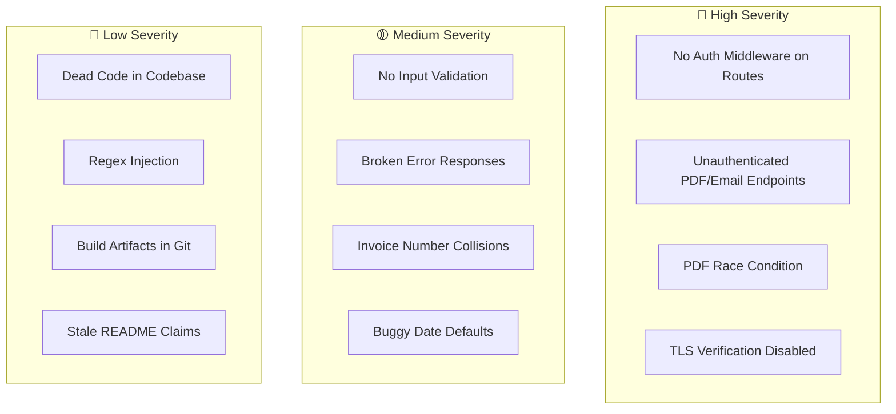

# Code Review Gaps

## Overview
This document is a senior-level code review of the Accountill codebase, identifying security vulnerabilities, correctness issues, data integrity problems, UX gaps, and documentation drift. Each issue is backed by specific file:line evidence from the source code.

---

## Gap Summary Diagram

---

## Detailed Gap Table

| # | Type | What is Wrong | Evidence | Who it Hurts | Suggested Fix | Severity |
|---|---|---|---|---|---|---|
| **1** | **Security** | **Auth middleware exists but is never used on any route.** The file `server/middleware/auth.js` defines JWT validation logic, but none of the 4 route files import or use it. All CRUD endpoints for invoices, clients, and profiles are completely **public**. Any external caller can read, modify, or delete any user's data. | `server/routes/invoices.js:1–14` — no `auth` import. `server/routes/clients.js:1–12` — no `auth` import. `server/routes/profile.js:1–14` — no `auth` import. Compare with `server/middleware/auth.js:7–31` which exists but is unused. | **All users** — total data exposure | Import `auth` middleware and apply it to all protected routes: `router.get('/', auth, getInvoicesByUser)` | **🔴 HIGH** |
| **2** | **Security** | **PDF generation and email sending endpoints have zero authentication.** `POST /send-pdf`, `POST /create-pdf`, and `GET /fetch-pdf` are defined directly in `server/index.js` without any auth middleware. Anyone on the internet can: (a) use the server's SMTP credentials to send emails, (b) generate PDFs with arbitrary content, (c) download the last generated PDF. | `server/index.js:53` — `app.post('/send-pdf', (req, res) => {` — no middleware. `server/index.js:87` — `app.post('/create-pdf', ...)`. `server/index.js:97` — `app.get('/fetch-pdf', ...)` | **All users** — SMTP abuse, data leakage | Add auth middleware to all PDF/email routes. Also add rate limiting. | **🔴 HIGH** |
| **3** | **Correctness** | **PDF race condition — single shared file.** All PDF operations write to the same `invoice.pdf` file at `${__dirname}/invoice.pdf`. If two users generate PDFs simultaneously, one user may receive the other's invoice as an email attachment. | `server/index.js:57` — `.toFile('invoice.pdf', ...)`. `server/index.js:69` — `path: '${__dirname}/invoice.pdf'`. `server/index.js:88` — `.toFile('invoice.pdf', ...)` | **All users** — receiving wrong invoices | Use unique filenames per request (e.g., `invoice-${uuid}.pdf`) and clean up after sending. Or use `toBuffer()` instead of `toFile()`. | **🔴 HIGH** |
| **4** | **Security** | **TLS certificate verification disabled on SMTP transport.** The Nodemailer configuration sets `tls: { rejectUnauthorized: false }`, which disables certificate validation and makes the connection vulnerable to man-in-the-middle attacks. | `server/index.js:45–47` — `tls: { rejectUnauthorized: false }`. Also duplicated at `server/controllers/user.js:97–99` | **All users** — email credentials could be intercepted | Remove `rejectUnauthorized: false` and ensure valid TLS certificates on the SMTP server. | **🔴 HIGH** |
| **5** | **Correctness** | **No server-side input validation on any endpoint.** Controllers directly use `req.body` without validating required fields, data types, or bounds. The invoice model stores `unitPrice`, `quantity`, `discount` as `String`, but the PDF template performs arithmetic on them. | `server/controllers/invoices.js:55` — `const invoice = req.body` (no validation). `server/models/InvoiceModel.js:6` — `unitPrice: String`. `server/documents/index.js:169` — `item.quantity * item.unitPrice` (implicit string-to-number coercion) | **All users** — corrupted invoices, NaN in PDFs | Add validation middleware (e.g., `express-validator` or `joi`). Change numeric fields to `Number` type in schema. | **🟡 MEDIUM** |
| **6** | **Correctness** | **Broken error responses in PDF endpoints.** The code uses `res.send(Promise.reject())` and `res.send(Promise.resolve())` which send Promise objects, not meaningful HTTP responses. The response is sent before knowing if the email was actually delivered. | `server/index.js:74` — `res.send(Promise.reject())`. `server/index.js:76` — `res.send(Promise.resolve())`. The `sendMail()` callback result is never awaited. | **All users** — no feedback on email success/failure | Use proper async/await or callbacks. Send `res.status(200).json({success: true})` on success and `res.status(500).json({error})` on failure. | **🟡 MEDIUM** |
| **7** | **Data** | **Invoice numbers can collide.** Invoice numbers are generated client-side using `Math.floor(Math.random() * 100000)`, which has only 100,000 possible values. There is no uniqueness check in the database. | `client/src/initialState.js:13` — `invoiceNumber: Math.floor(Math.random() * 100000)`. No `unique: true` on `invoiceNumber` in `server/models/InvoiceModel.js:13` | **Users with many invoices** — duplicate invoice numbers confuse accounting | Generate sequential numbers server-side, or use a UUID. Add a unique index on `invoiceNumber` per user. | **🟡 MEDIUM** |
| **8** | **Data** | **`createdAt` default evaluates once at schema load, not per document.** Both `InvoiceModel` and `ClientModel` use `default: new Date()` which is evaluated when the schema is loaded, meaning all documents get the same timestamp unless explicitly overridden. | `server/models/InvoiceModel.js:21` — `default: new Date()`. `server/models/ClientModel.js:12` — `default: new Date()`. Compare: `controllers/clients.js:57` works around this by setting `createdAt: new Date().toISOString()` explicitly. | **Data integrity** — wrong timestamps | Use `default: Date.now` (function reference, not invocation) instead of `default: new Date()` | **🟡 MEDIUM** |
| **9** | **Security** | **Regex injection in profile search.** User input is directly interpolated into a `RegExp` constructor without escaping special characters. A malicious search query could cause ReDoS (Regular Expression Denial of Service). | `server/controllers/profile.js:89–90` — `const name = new RegExp(searchQuery, "i")` | **Server availability** — ReDoS can freeze the Node.js event loop | Escape special regex characters before constructing the RegExp, or use MongoDB's `$text` search. | **🔵 LOW** |
| **10** | **Correctness** | **Auth middleware fails silently.** When the JWT is invalid or expired, the auth middleware catches the error and logs it but does **not** send a response. The request hangs indefinitely because `next()` is never called in the catch block, and no `res.status(401)` is sent. | `server/middleware/auth.js:29–31` — `catch (error) { console.log(error) }` — no `res.status(401)` or `next()` | **All users** — requests hang on expired tokens | Add `return res.status(401).json({ message: 'Authentication failed' })` in the catch block. | **🟡 MEDIUM** |
| **11** | **Security** | **No ownership verification on CRUD operations.** When updating or deleting an invoice/client/profile, the server only checks if the MongoDB ObjectId is valid — it does **not** verify that the document belongs to the requesting user. | `controllers/invoices.js:85` — checks `ObjectId.isValid` but not `creator === req.userId`. `controllers/clients.js:71` — same pattern. `controllers/profile.js:105` — same pattern. | **All users** — any user can modify/delete another user's data | Add ownership check: `if(invoice.creator !== req.userId) return res.status(403)` | **🔴 HIGH** |
| **12** | **UX** | **Password reset link hardcoded to production URL.** The reset email contains `https://accountill.com/reset/${token}` — this won't work in local development. | `server/controllers/user.js:122` — `href="https://accountill.com/reset/${token}"` | **Developers** — password reset broken in dev | Use an environment variable for the base URL: `process.env.CLIENT_URL` | **🔵 LOW** |
| **13** | **Docs Drift** | **README mentions "Google auth" but auth flow has changed.** README references `react-google-login` (`README.md:56`) but `package.json` uses `@react-oauth/google` (`client/package.json:14`), which is a different library with a different API. | `README.md:56` vs `client/package.json:14` | **New developers** — wrong setup instructions | Update README to reference `@react-oauth/google` | **🔵 LOW** |
| **14** | **Correctness** | **Dead code throughout the codebase.** Multiple commented-out functions and unused files clutter the code. | `controllers/clients.js:7–21` (commented getClients). `controllers/user.js:71–80` (commented updateProfile). `server/documents/invoice.js` (unused — import commented at `index.js:22`). `client/src/store.js` (unrelated equipment data). `routes/profile.js:7` (commented getProfiles route). | **Maintainability** — confusion for new developers | Remove all commented-out code and unused files. | **🔵 LOW** |
| **15** | **Data** | **User's `bio` field is passed on signup but not stored.** The signup controller destructures `bio` from `req.body` and passes it to `User.create()`, but the User schema has no `bio` field — Mongoose silently drops it. | `controllers/user.js:47` — `const { ..., bio } = req.body`. `models/userModel.js:3–9` — no `bio` field. | **Users** — bio data silently lost | Either add `bio` to the User schema or remove it from the signup destructuring. | **🔵 LOW** |

---

## Security Architecture Gap Visualization

```mermaid
graph TD
    subgraph "Expected Auth Flow"
        R1["Client sends Bearer token"] --> R2["Auth middleware validates JWT"]
        R2 --> R3["req.userId set"]
        R3 --> R4["Controller checks ownership"]
        R4 --> R5["Database operation"]
    end

    subgraph "Actual Auth Flow (Current Code)"
        A1["Client sends Bearer token"] --> A2["Token ignored — no middleware on routes"]
        A2 --> A3["Controller uses req.body directly"]
        A3 --> A4["Database operation — no ownership check"]
    end

    style R2 fill:#90EE90
    style R3 fill:#90EE90
    style R4 fill:#90EE90
    style A2 fill:#FFB6C1
    style A3 fill:#FFB6C1
    style A4 fill:#FFB6C1
```

---

## Summary Statistics

| Severity | Count | Description |
|---|---|---|
| 🔴 **HIGH** | 5 | Auth bypass, public CRUD, race condition, no ownership check, TLS disabled |
| 🟡 **MEDIUM** | 4 | No validation, broken error handling, invoice collisions, silent auth failure |
| 🔵 **LOW** | 6 | Dead code, regex injection, hardcoded URLs, docs drift, build artifacts |
| **Total** | **15** | |
