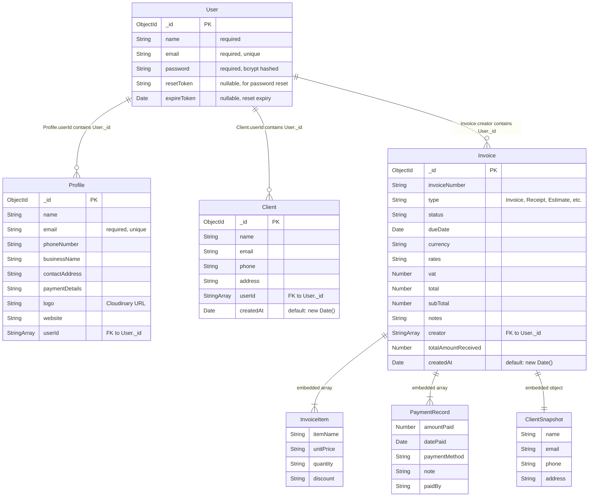
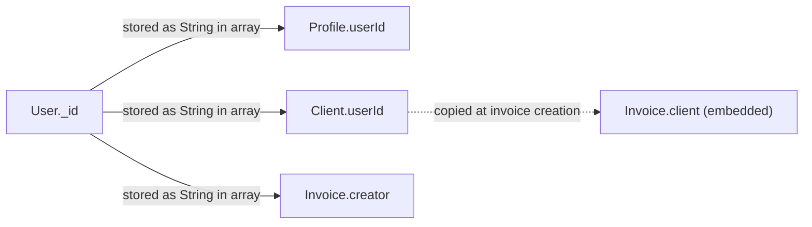

# Data Model

## Overview
Accountill uses **MongoDB** as its database, accessed through **Mongoose 5.12.10** ODM. There are 4 Mongoose models, each representing a MongoDB collection. Relationships are maintained via embedded string arrays containing user IDs — **not** via proper Mongoose `ObjectId` references.

---

## Entity Relationship Diagram



---

## Detailed Entity Documentation

### 1. User (`server/models/userModel.js:3–9`)

**Collection name**: `users`

| Field | Type | Constraints | Purpose |
|---|---|---|---|
| `_id` | ObjectId | Auto-generated PK | Unique identifier |
| `name` | String | `required: true` | Full name (constructed as `${firstName} ${lastName}` during signup) |
| `email` | String | `required: true, unique: true` | Login identifier, must be unique |
| `password` | String | `required: true` | bcrypt-hashed password (12 salt rounds). Evidence: `controllers/user.js:57` |
| `resetToken` | String | Optional | Random hex token for password reset. Generated by `crypto.randomBytes(32)` at `controllers/user.js:103–107` |
| `expireToken` | Date | Optional | Reset token expiry. Set to `Date.now() + 3600000` (1 hour). Evidence: `controllers/user.js:114` |

**Indexes**: Unique index on `email` (Mongoose enforces via `unique: true`).

**Used by**:
- `server/controllers/user.js:22` — `User.findOne({ email })` for signin
- `server/controllers/user.js:50` — `User.findOne({ email })` for signup duplicate check
- `server/controllers/user.js:108` — `User.findOne({email})` for password reset
- `server/controllers/user.js:140` — `User.findOne({resetToken, expireToken: {$gt: Date.now()}})` for reset validation

---

### 2. Profile (`server/models/ProfileModel.js:3–13`)

**Collection name**: `profiles`

| Field | Type | Constraints | Purpose |
|---|---|---|---|
| `_id` | ObjectId | Auto-generated PK | Unique identifier |
| `name` | String | None | Display name on invoices |
| `email` | String | `required: true, unique: true` | Business contact email |
| `phoneNumber` | String | None | Business phone number |
| `businessName` | String | None | Company name displayed on PDF invoices |
| `contactAddress` | String | None | Business address |
| `paymentDetails` | String | None | Payment instructions (appears as invoice notes) |
| `logo` | String | None | URL to business logo (Cloudinary) |
| `website` | String | None | Business website URL |
| `userId` | [String] | None | Array containing the owning User's `_id` as a string |

**Relationship to User**: Stored as `userId: [String]` — an array of plain strings, not Mongoose ObjectId references. This means Mongoose does **not** enforce referential integrity.

Evidence: `server/models/ProfileModel.js:12` — `userId: [String]`

**Auto-created on signup**: When a user signs up, a blank Profile is immediately created:
```javascript
// client/src/actions/auth.js:30
const { info } = await api.createProfile({
    name: data?.result?.name,
    email: data?.result?.email,
    userId: data?.result?._id,
    phoneNumber: '', businessName: '', contactAddress: '', logo: '', website: ''
});
```

**Used by**:
- `server/controllers/profile.js:75` — `ProfileModel.findOne({ userId: searchQuery })`
- `server/controllers/user.js:25` — `ProfileModel.findOne({ userId: existingUser?._id })` (fetched during login)

---

### 3. Client (`server/models/ClientModel.js:4–14`)

**Collection name**: `clientmodels`

| Field | Type | Constraints | Purpose |
|---|---|---|---|
| `_id` | ObjectId | Auto-generated PK | Unique identifier |
| `name` | String | None | Client's full name |
| `email` | String | None | Client's email address |
| `phone` | String | None | Client's phone number |
| `address` | String | None | Client's mailing address |
| `userId` | [String] | None | Array containing the owning User's `_id` |
| `createdAt` | Date | `default: new Date()` | Record creation timestamp |

**⚠️ Bug**: The `default: new Date()` is evaluated once at schema definition time, not per document creation. The controller works around this by explicitly setting the date:
```javascript
// server/controllers/clients.js:57
const newClient = new ClientModel({...client, createdAt: new Date().toISOString() })
```

**Used by**:
- `server/controllers/clients.js:94` — `ClientModel.find({ userId: searchQuery })`
- `server/controllers/clients.js:45` — `ClientModel.find().sort({ _id: -1 }).limit(LIMIT).skip(startIndex)` (paginated)

---

### 4. Invoice (`server/models/InvoiceModel.js:3–23`)

**Collection name**: `invoicemodels`

| Field | Type | Constraints | Purpose |
|---|---|---|---|
| `_id` | ObjectId | Auto-generated PK | Unique identifier |
| `invoiceNumber` | String | None | User-facing invoice number (generated randomly in frontend: `Math.floor(Math.random() * 100000)` at `client/src/initialState.js:13`) |
| `type` | String | None | Document type: "Invoice", "Receipt", "Estimate", "Quotation", "Bill" |
| `status` | String | None | Payment status |
| `dueDate` | Date | None | Payment deadline |
| `currency` | String | None | Currency code for the invoice |
| `items` | Array | None | Embedded array of line items (see below) |
| `rates` | String | None | Not sure — possibly tax rates |
| `vat` | Number | None | VAT percentage |
| `total` | Number | None | Grand total after VAT |
| `subTotal` | Number | None | Sum before VAT |
| `notes` | String | None | Additional notes (populated from `paymentDetails` of user's profile) |
| `creator` | [String] | None | Array containing the User's `_id` who created the invoice |
| `totalAmountReceived` | Number | None | Sum of all payments received |
| `client` | Object | None | **Embedded snapshot** of client info (see below) |
| `paymentRecords` | Array | None | Embedded array of payment entries (see below) |
| `createdAt` | Date | `default: new Date()` | Creation timestamp (**same bug as Client**) |

#### Embedded: `items` Array
```javascript
// server/models/InvoiceModel.js:6
items: [ { itemName: String, unitPrice: String, quantity: String, discount: String } ]
```
**⚠️ Note**: `unitPrice`, `quantity`, and `discount` are `String` type, but the PDF template does arithmetic on them (`item.quantity * item.unitPrice` at `server/documents/index.js:169`). JavaScript coerces strings to numbers here, but this is fragile.

#### Embedded: `client` Object
```javascript
// server/models/InvoiceModel.js:17
client: { name: String, email: String, phone: String, address: String }
```
This is a **snapshot pattern** — client details are copied into the invoice at creation time. If the client record is later updated, existing invoices retain the old data. This is intentional for invoicing (the invoice should reflect who it was billed to at that time).

#### Embedded: `paymentRecords` Array
```javascript
// server/models/InvoiceModel.js:18
paymentRecords: [ { amountPaid: Number, datePaid: Date, paymentMethod: String, note: String, paidBy: String } ]
```

**Used by**:
- `server/controllers/invoices.js:13` — `InvoiceModel.find({ creator: searchQuery })`
- `server/controllers/invoices.js:27` — `InvoiceModel.countDocuments({ creator: searchQuery })`
- `server/documents/index.js:3` — Template reads all fields for PDF rendering

---

## Relationship Summary



| From | To | How Stored | Type | Evidence |
|---|---|---|---|---|
| User → Profile | `Profile.userId = [User._id as String]` | Array of plain strings | Loose FK (no Mongoose ref) | `ProfileModel.js:12` |
| User → Client | `Client.userId = [User._id as String]` | Array of plain strings | Loose FK (no Mongoose ref) | `ClientModel.js:9` |
| User → Invoice | `Invoice.creator = [User._id as String]` | Array of plain strings | Loose FK (no Mongoose ref) | `InvoiceModel.js:15` |
| Client → Invoice | `Invoice.client = { name, email, phone, address }` | Embedded document | Snapshot (denormalized copy) | `InvoiceModel.js:17` |
| Invoice → PaymentRecords | `Invoice.paymentRecords = [{ ... }]` | Embedded array | Embedded sub-documents | `InvoiceModel.js:18` |
| Invoice → Items | `Invoice.items = [{ ... }]` | Embedded array | Embedded sub-documents | `InvoiceModel.js:6` |

---

## Unused / Leftover Fields & Entities

| Item | Why it looks unused | Evidence |
|---|---|---|
| `User.bio` | Not in the schema but passed during signup | `controllers/user.js:47` passes `bio` but `userModel.js` has no `bio` field — Mongoose silently drops it |
| `Invoice.rates` | Defined as `String` but never used in the PDF template or any controller logic | `InvoiceModel.js:7` |
| `store.js` (client) | Contains unrelated array data about GPS, mistnets, cameras — completely dead code | `client/src/store.js:6–35` |
| `getProfiles` in profile controller | Commented out in route file | `routes/profile.js:7` — `// router.get('/', getProfiles)` |
| `getClients` (old version) | Commented out in clients controller | `controllers/clients.js:7–21` |
