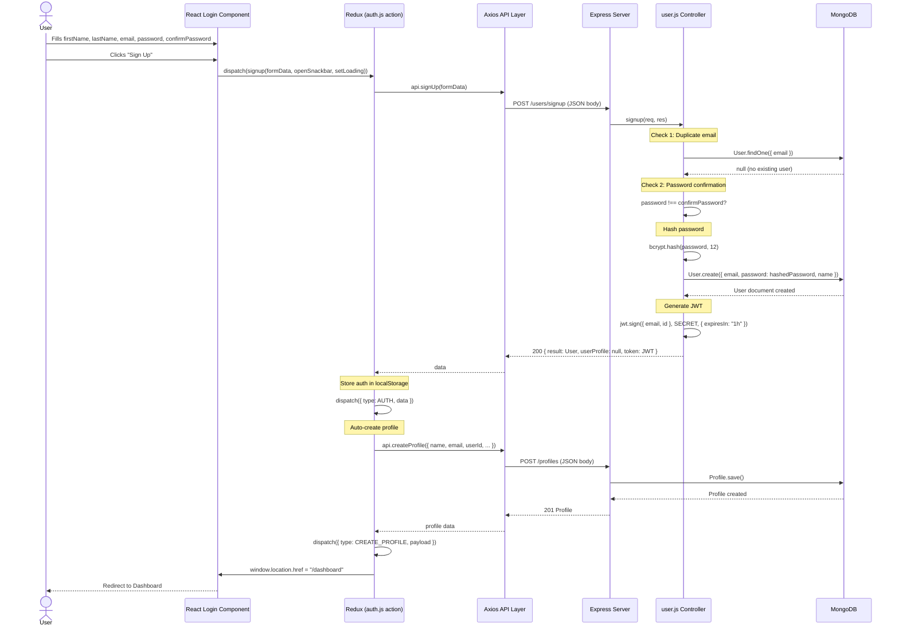
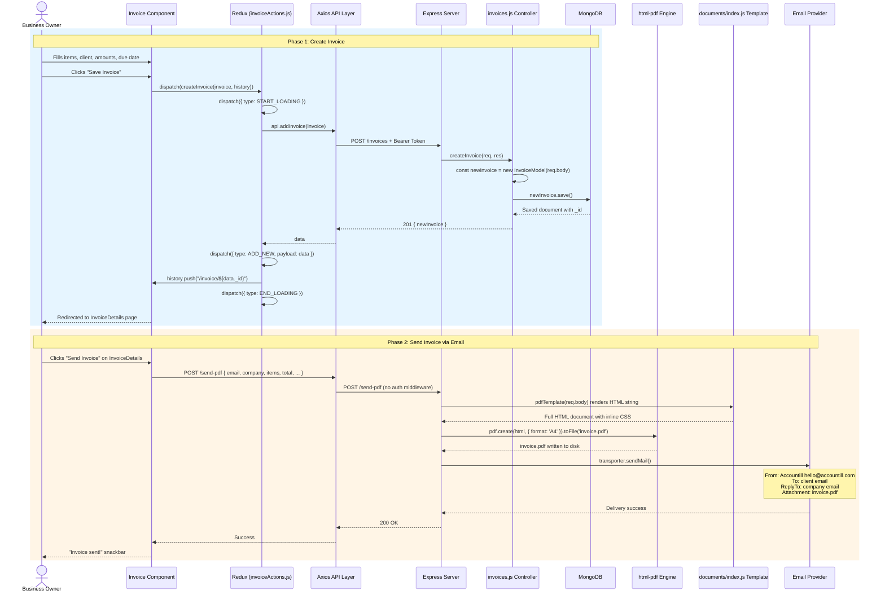

# Feature Trace: User Signs Up and Creates Their First Invoice

This document traces two key features end-to-end through the entire codebase, following every function call from the browser to the database and back.

---

## Trace 1: User Registration (Signup)

### Sequence Diagram

### Step-by-Step Walkthrough

| # | Step | What Happens | Data Read/Written | Evidence |
|---|---|---|---|---|
| 1 | User submits signup form | `formData` = `{ firstName, lastName, email, password, confirmPassword }` | — | `client/src/actions/auth.js:24` |
| 2 | Redux action dispatched | `signup` thunk calls `api.signUp(formData)` | — | `client/src/actions/auth.js:28` |
| 3 | Axios sends POST | `POST /users/signup` with JSON body. Bearer token is **not** attached (no profile in localStorage yet). | — | `client/src/api/index.js:30` |
| 4 | **Check: Duplicate email** | `User.findOne({ email })` — if user exists, returns `400: "User already exist"` | Reads: `users` collection | `server/controllers/user.js:50,53` |
| 5 | **Check: Password match** | `password !== confirmPassword` — if mismatch, returns `400: "Password don't match"` | — | `server/controllers/user.js:55` |
| 6 | Hash password | `bcrypt.hash(password, 12)` — 12 salt rounds | — | `server/controllers/user.js:57` |
| 7 | Create user | `User.create({ email, password: hashedPassword, name: '${firstName} ${lastName}' })` | Writes: `users` collection | `server/controllers/user.js:59` |
| 8 | Generate token | `jwt.sign({ email, id }, SECRET, { expiresIn: "1h" })` | — | `server/controllers/user.js:61` |
| 9 | Return response | `200 { result, userProfile: (undefined on signup), token }` | — | `server/controllers/user.js:63` |
| 10 | Client stores auth | Redux `AUTH` action stores data. LocalStorage set via reducer. | Writes: `localStorage['profile']` | `client/src/actions/auth.js:29` |
| 11 | Auto-create profile | Client calls `api.createProfile(...)` with blank business fields | Writes: `profiles` collection | `client/src/actions/auth.js:30` |
| 12 | Redirect | `window.location.href = "/dashboard"` (full page reload) | — | `client/src/actions/auth.js:32` |

### Failure Scenarios
| Failure | Error Returned | Database State | Evidence |
|---|---|---|---|
| Duplicate email | `400: "User already exist"` | No change | `controllers/user.js:53` |
| Password mismatch | `400: "Password don't match"` | No change | `controllers/user.js:55` |
| Server error (DB down) | `500: "Something went wrong"` | No change | `controllers/user.js:66` |
| Profile creation fails after user created | User exists in DB but has no Profile | User is orphaned without a profile — dashboard may error | `client/src/actions/auth.js:30` (no rollback) |

---

## Trace 2: Creating and Sending an Invoice

### Sequence Diagram

### Step-by-Step Walkthrough

| # | Step | What Happens | Data | Evidence |
|---|---|---|---|---|
| 1 | Form filled | User enters line items (`itemName`, `unitPrice`, `quantity`, `discount`), selects client, sets due date, currency | Initial state from `client/src/initialState.js:4–17` | `initialState.js:4–17` |
| 2 | Invoice number generated | `Math.floor(Math.random() * 100000)` — **not sequential**, potential for collisions | — | `initialState.js:13` |
| 3 | Redux action | `createInvoice(invoice, history)` dispatches `START_LOADING`, calls API, dispatches `ADD_NEW` | — | `actions/invoiceActions.js:42–52` |
| 4 | API call | `POST /invoices` with the full invoice object as JSON body | — | `api/index.js:16` |
| 5 | Controller | `const newInvoice = new InvoiceModel(invoice)` then `newInvoice.save()` | Writes: `invoicemodels` collection | `controllers/invoices.js:55–61` |
| 6 | **No validation** | Controller does **not** validate required fields, amounts, or check that the `creator` matches the authenticated user | — | `controllers/invoices.js:53–66` |
| 7 | Redirect | `history.push('/invoice/${data._id}')` navigates to InvoiceDetails | — | `actions/invoiceActions.js:47` |
| 8 | Send PDF | User clicks send button → `POST /send-pdf` with invoice data and recipient email | — | `server/index.js:53` |
| 9 | PDF render | `html-pdf` renders the `documents/index.js` template into an A4 PDF | — | `server/index.js:57` |
| 10 | File write | PDF saved to `${__dirname}/invoice.pdf` (single file, overwritten each time) | Writes: disk file | `server/index.js:57` |
| 11 | Email send | Nodemailer sends email with PDF attachment | — | `server/index.js:60–71` |
| 12 | **No auth on /send-pdf** | This endpoint has **no authentication** — anyone can call it | — | `server/index.js:53` |

### Failure Scenarios
| Failure | What Happens | Database State | Evidence |
|---|---|---|---|
| DB save fails | `409` status with error message returned | No invoice created | `controllers/invoices.js:63` |
| PDF generation fails | `res.send(Promise.reject())` — sends a rejected promise object (not a proper error response) | Invoice already saved in DB | `server/index.js:73–74` |
| SMTP failure | Email not delivered, but `res.send(Promise.resolve())` is called regardless (response sent before knowing if email succeeded) | Invoice exists, PDF on disk, email not delivered | `server/index.js:76` |
| Concurrent requests | Multiple users generating PDFs simultaneously would overwrite the same `invoice.pdf` file — **race condition** | Corrupt/mixed PDF attachments | `server/index.js:57` |

### Validation Checks Along the Path
| Check | Where | What it validates |
|---|---|---|
| JWT token presence | `client/src/api/index.js:7` (interceptor) | Attaches token if profile exists in localStorage |
| ObjectId validity (on update/delete only) | `controllers/invoices.js:85,96` | `mongoose.Types.ObjectId.isValid(_id)` |
| **No server-side input validation** | — | No check for required fields, valid numbers, valid email, etc. |
| **No ownership check** | — | No check that the invoice belongs to the requesting user |

---

## Key Observations from the Traces

1. **Signup creates a Profile automatically** from the client side — if this call fails, the user has no profile and the app may break.
2. **Invoice numbers are random**, not sequential — `Math.floor(Math.random() * 100000)` can produce duplicates.
3. **PDF generation uses a single shared file** on disk — concurrent requests will corrupt each other's PDFs.
4. **The `/send-pdf` endpoint has zero authentication** — any external caller could use it to send emails through the server's SMTP credentials.
5. **Error handling in the PDF/email pipeline is broken** — `res.send(Promise.reject())` and `res.send(Promise.resolve())` are not valid Express responses.
