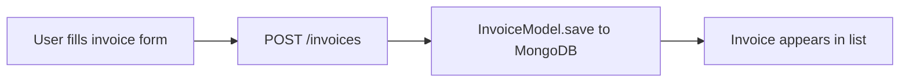
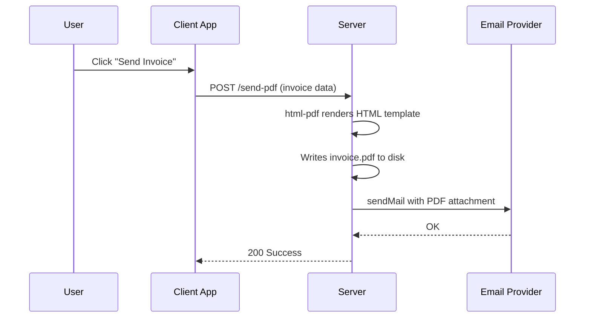
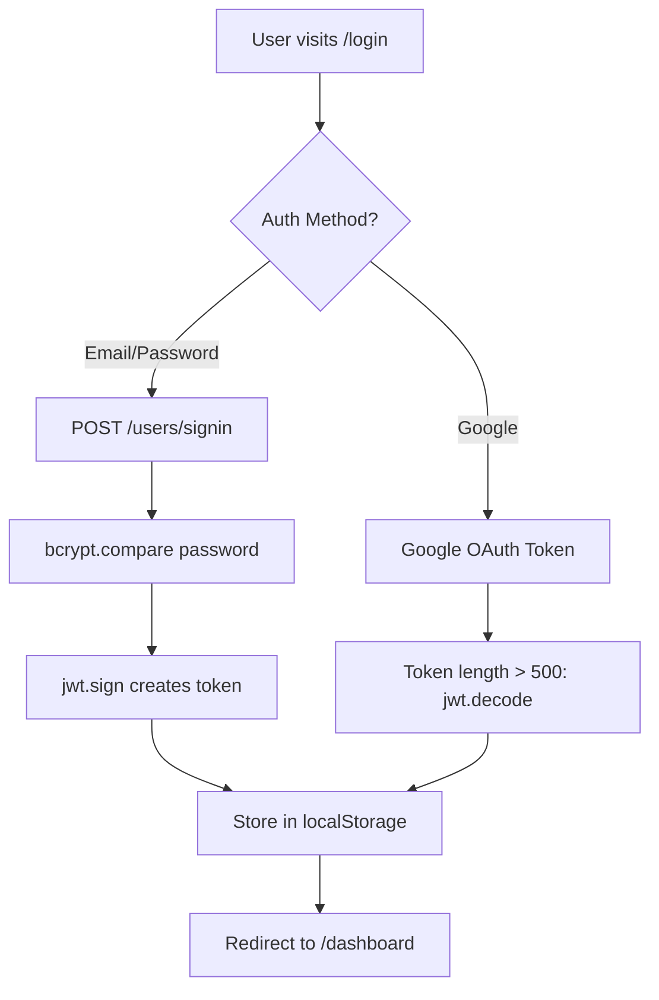

# Product Explanation

## 1. What It Does (3 Sentences)

Accountill is a full-stack web application that allows users to create, manage, and send professional invoices, receipts, estimates, and quotations to their clients. It is built for **freelancers and small businesses** who need a simple way to bill their clients and track payments. Users would choose it because it offers PDF generation, email delivery, payment tracking, and a dashboard — all in one self-hosted application, free of charge under an MIT license.

Evidence: `README.md:27`, `README.md:31–40`, `LICENSE.md`

---

## 2. User Roles

### Role: Business Owner / Freelancer (Single Role)
This application has a **single user role**. There is no admin, super-admin, or differentiated role system. Every registered user can:

| Capability | Evidence |
|---|---|
| Register with email/password | `server/controllers/user.js:46–68` (signup handler) |
| Login with email/password or Google OAuth | `server/controllers/user.js:18–42`, `client/package.json:14` (@react-oauth/google) |
| Reset forgotten passwords via email | `server/controllers/user.js:85–156` (forgot + reset handlers) |
| Create and manage a business profile (name, logo, contact, payment details) | `server/controllers/profile.js:30–65`, `server/models/ProfileModel.js:3–13` |
| Add, edit, and delete clients | `server/controllers/clients.js:53–87`, `server/routes/clients.js:6–10` |
| Create, edit, and delete invoices | `server/controllers/invoices.js:53–101`, `server/routes/invoices.js:6–11` |
| Generate PDF invoices | `server/index.js:87–94` (POST /create-pdf) |
| Send invoices via email with PDF attachment | `server/index.js:53–78` (POST /send-pdf) |
| Record partial or full payments against invoices | `server/models/InvoiceModel.js:18` (paymentRecords embedded array) |
| View a dashboard with invoice statistics | `client/src/App.js:39` (Dashboard route) |

**No multi-tenancy or team features exist.** Each user sees only their own data, filtered by `creator` (for invoices) or `userId` (for clients/profiles).

Evidence: `server/controllers/invoices.js:13` — `InvoiceModel.find({ creator: searchQuery })`

---

## 3. Main Features

### Feature 1: Invoice Management (CRUD)
Create, read, update, and delete invoices with line items, VAT, discounts, and due dates.

- **Implementation**: `server/controllers/invoices.js:53–66` (create), `server/routes/invoices.js:6–11` (routes)
- **Data model**: `server/models/InvoiceModel.js:3–23`
- **Frontend**: `client/src/components/Invoice/` (form), `client/src/components/Invoices/` (list)
- **Redux flow**: `client/src/actions/invoiceActions.js:42–52` → `client/src/api/index.js:16`

### Feature 2: PDF Generation & Email Delivery
Generate professional PDF invoices and send them to clients via SMTP email.

- **PDF template**: `server/documents/index.js:3–219` (full HTML template with CSS)
- **Email template**: `server/documents/email.js:3–160` (branded HTML email body)
- **Server handler**: `server/index.js:53–78` (send-pdf), `server/index.js:87–94` (create-pdf)
- **PDF download**: `server/index.js:97–99` (GET /fetch-pdf serves the file)

### Feature 3: Client Management
Add and manage customer records that can be associated with invoices.

- **CRUD operations**: `server/controllers/clients.js:24–87`
- **Paginated listing**: `server/controllers/clients.js:37–51` (LIMIT = 8 per page)
- **Data model**: `server/models/ClientModel.js:4–14`
- **Frontend**: `client/src/components/Clients/ClientList` (route: `/customers`)

### Feature 4: Authentication & Password Recovery
Full signup/signin flow with JWT tokens, Google OAuth, and email-based password reset.

- **Signin**: `server/controllers/user.js:18–42` — bcrypt compare + JWT sign with 1h expiry
- **Signup**: `server/controllers/user.js:46–68` — auto-creates a Profile on signup
- **Auth middleware**: `server/middleware/auth.js:7–31` — distinguishes custom JWT vs Google token by checking `token.length < 500`
- **Password reset**: `server/controllers/user.js:85–156` — crypto.randomBytes for reset token, 1 hour expiry (`Date.now() + 3600000`)
- **Client-side storage**: `client/src/App.js:23` — `localStorage.getItem('profile')`
- **API interceptor**: `client/src/api/index.js:6–12` — attaches Bearer token to every request

### Feature 5: Dashboard & Payment Tracking
Visual dashboard with charts showing invoice statistics.

- **Dashboard route**: `client/src/App.js:39` — `/dashboard` renders `Dashboard` component
- **Chart libraries**: ApexCharts (`client/package.json:18`), Recharts (`client/package.json:37`)
- **Payment records**: `server/models/InvoiceModel.js:18` — embedded `paymentRecords` array with `amountPaid`, `datePaid`, `paymentMethod`, `note`, `paidBy`
- **Balance tracking**: `server/models/InvoiceModel.js:16` — `totalAmountReceived` field

---

## 4. Claims in README Not Found in Code

| README Claim | Status | Notes |
|---|---|---|
| "Set due date" | **Found** | `server/models/InvoiceModel.js:4` — `dueDate: Date` |
| "Automatic status change when payment record is added" | **Not sure** | The `status` field exists (`InvoiceModel.js:12`) but no server-side logic was found that automatically changes status on payment. This is likely handled client-side. |
| "Cloudinary for logo uploads" | **Partial** | The `logo` field is a String in `ProfileModel.js:10`. The README mentions Cloudinary (`README.md:54`) but no Cloudinary SDK appears in `server/package.json`. Upload likely happens client-side via react-dropzone (`client/package.json:28`). |
| "Multiple user registration" | **Found** | `server/controllers/user.js:46–68` — standard signup, no limit on registrations |
| "Clean admin dashboard" | **Partial** | Dashboard component exists (`client/src/App.js:39`) but there is no admin distinction — every user sees their own dashboard |
