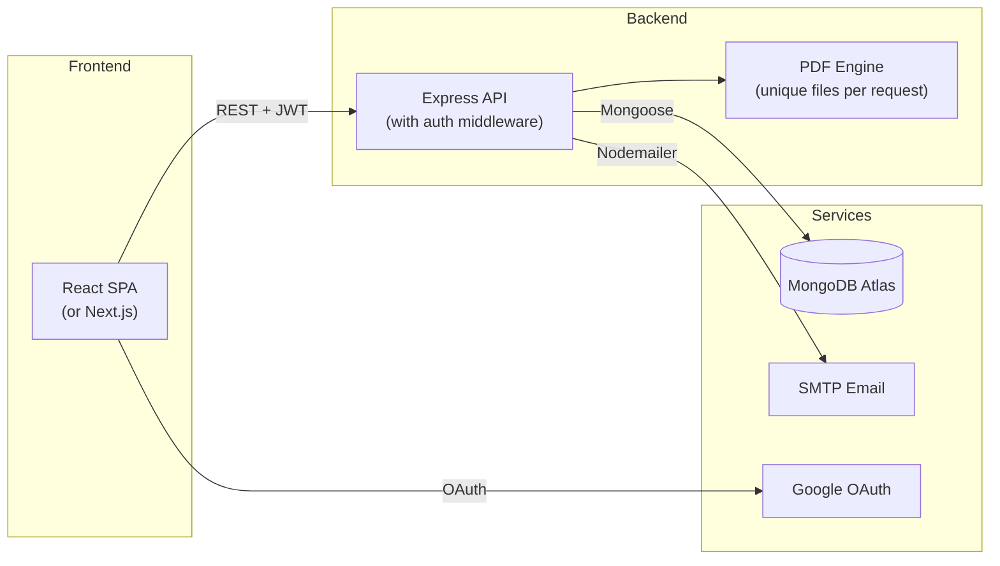
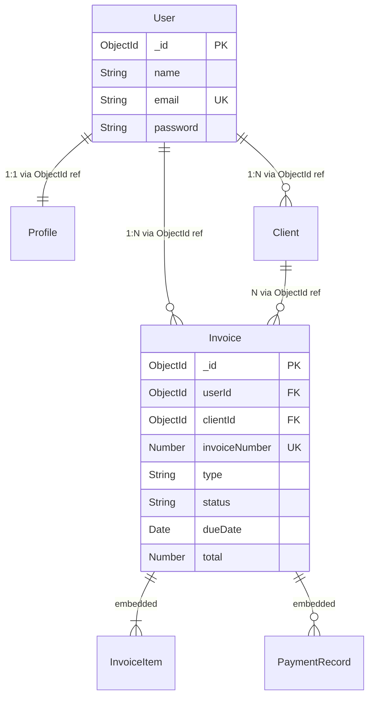

# Team Documentation — Rebuild Planning

This document consolidates the verified observations into a rebuild brief for the team's AI agent. It contains all the structured documentation files referenced in the original prompts.

---

## OBSERVATIONS.md Summary

All verified claims are documented in the companion file `verified_claims.md`. Key observations grouped by topic:

### Authentication & Security
- Auth middleware exists (`server/middleware/auth.js`) but is **not applied** to any route [Confirmed]
- JWT tokens expire in 1 hour (`server/controllers/user.js:34`) [Confirmed]
- Password hashing uses bcrypt with 12 salt rounds (`server/controllers/user.js:57`) [Confirmed]
- Google vs custom JWT distinguished by `token.length < 500` (`server/middleware/auth.js:10`) [Confirmed]
- No ownership verification on any CRUD operation [Confirmed]
- TLS verification disabled on SMTP (`server/index.js:46`) [Confirmed]

### Data Architecture
- 4 Mongoose models: User, Profile, Client, Invoice [Confirmed]
- Relationships use `[String]` arrays, not Mongoose ObjectId refs [Confirmed]
- Invoice embeds client data as snapshot (denormalized) [Confirmed]
- `createdAt` defaults evaluated once at schema load time [Confirmed]
- Invoice items use String types for numeric fields [Confirmed]

### Core Features
- Full CRUD for invoices, clients, profiles [Confirmed]
- PDF generation via html-pdf writing to single shared file [Confirmed]
- Email sending via Nodemailer with PDF attachment [Confirmed]
- Client-side signup auto-creates a blank Profile [Confirmed]
- Invoice numbers generated randomly (collision risk) [Confirmed]

---

## PRD.md — Product Requirements Document

### Problem
Freelancers and small businesses need a simple, affordable way to create professional invoices, track payments, and manage client relationships without complex enterprise accounting software.

### Target User
Freelancers and small business owners who bill clients for services or products.

### One-Line Problem Statement
For **freelancers** who **struggle with professional billing and payment tracking**, **Accountill** does **invoice creation, PDF generation, and email delivery**, unlike **spreadsheets or expensive accounting platforms**.

### Core Flow (Numbered Steps)
1. User signs up with email/password or Google OAuth
2. User sets up their business profile (name, logo, contact info, payment details)
3. User adds client records (name, email, phone, address)
4. User creates an invoice with line items, selects client, sets due date and currency
5. System generates a PDF of the invoice
6. User sends the PDF to the client via email
7. User records partial or full payments against the invoice
8. Dashboard displays aggregate stats (total received, pending, charts)

### Features Ranked (MoSCoW)

| Priority | Feature | Evidence |
|---|---|---|
| **Must** | User registration and authentication (JWT + Google) | `server/controllers/user.js` |
| **Must** | Invoice CRUD (create, read, update, delete) | `server/controllers/invoices.js` |
| **Must** | PDF generation from invoice data | `server/index.js:87–94`, `server/documents/index.js` |
| **Must** | Email delivery of PDF invoices | `server/index.js:53–78` |
| **Must** | Client management (CRUD) | `server/controllers/clients.js` |
| **Should** | Business profile management (logo, payment details) | `server/controllers/profile.js` |
| **Should** | Payment recording and tracking | `server/models/InvoiceModel.js:18` (paymentRecords) |
| **Should** | Dashboard with statistics and charts | `client/src/components/Dashboard/` |
| **Should** | Password reset via email | `server/controllers/user.js:85–156` |
| **Could** | Multi-currency support | `client/src/currencies.json` |
| **Won't** | Multi-user collaboration / teams | Not found in codebase |
| **Won't** | Recurring invoices / automation | Not found in codebase |

### Out of Scope (for Original)
- Multi-tenant team accounts
- Recurring/scheduled invoices
- Tax calculation engine
- Payment gateway integration (Stripe, PayPal)
- Audit log / activity history
- Role-based access control

### Acceptance Criteria (Given / When / Then)

| # | Scenario | Given | When | Then |
|---|---|---|---|---|
| 1 | User signup | Given I am a new visitor | When I submit the signup form with valid email, password, and name | Then a User and Profile are created, I receive a JWT, and I am redirected to the dashboard |
| 2 | Create invoice | Given I am logged in and have at least one client | When I fill in invoice details and click Save | Then the invoice is saved to the database and I am redirected to its detail page |
| 3 | Send invoice email | Given I am viewing an invoice | When I click "Send Invoice" | Then a PDF is generated and emailed to the client's email address |
| 4 | Record payment | Given I am viewing an invoice with a balance due | When I add a payment record with amount and date | Then `totalAmountReceived` increases and `paymentRecords` array grows |
| 5 | Password reset | Given I have forgotten my password | When I submit my email on the forgot page | Then I receive an email with a reset link that expires in 1 hour |

---

## ARCHITECTURE.md — Rebuild Architecture

See the full architecture document: `architecture.md`

### Summary Diagram for Rebuild

### Key Decisions for Rebuild
1. **Apply auth middleware to all protected routes** — the original has this middleware but never uses it
2. **Use unique PDF filenames** (UUID-based) to prevent race conditions
3. **Store userId as ObjectId refs** instead of `[String]` for proper Mongoose population
4. **Generate invoice numbers server-side** (sequential, per-user) to prevent collisions
5. **Add input validation** using `express-validator` or `joi` on all endpoints
6. **Add ownership checks** in every controller before update/delete operations

---

## DATA_MODEL.md — Rebuild Data Model

See the full data model document: `data_model.md`

### Rebuild ER Diagram

### Key Changes from Original
- Use `ObjectId` refs with `ref: 'User'` for proper `.populate()` support
- Change `invoiceNumber` to auto-incrementing `Number` with unique index
- Change item `unitPrice`, `quantity`, `discount` from `String` to `Number`
- Use `default: Date.now` (function ref) for `createdAt`

---

## API.md — Rebuild API

See the full API document: `api_and_routes.md`

### Key Changes from Original
- **All routes protected by auth middleware** except `/users/signin`, `/users/signup`, `/users/forgot`, `/users/reset`
- **Ownership checks** on all update/delete/read operations
- **Input validation** on all POST/PATCH endpoints
- **Proper error responses** (no `Promise.reject()` in responses)

---

## GAPS.md — Original Gaps & Improvement Proposals

See the full gaps document: `code_review_gaps.md`

### Top 2 Improvements for Rebuild

#### Improvement 1: Proper Authentication & Authorization
**Why it matters**: The original app has auth middleware code that is never connected to routes. Every CRUD operation is publicly accessible. For a freelancer storing client data and financial records, this is a critical data privacy failure.

**What to build**:
- Apply JWT auth middleware to all non-public routes
- Add ownership verification (`invoice.creator === req.userId`) on every operation
- Return `401 Unauthorized` or `403 Forbidden` with clear error messages
- Add rate limiting on public endpoints (login, signup, forgot)

#### Improvement 2: Concurrent-Safe PDF Pipeline
**Why it matters**: The original writes all PDFs to a single `invoice.pdf` file. Under concurrent load, User A could receive User B's invoice — a serious data leak for a financial application.

**What to build**:
- Generate PDFs to unique temp files (`invoice-${uuid}.pdf`)
- Use `pdf.create().toBuffer()` instead of `toFile()` where possible
- Clean up temp files after email delivery
- Add proper async/await error handling with meaningful HTTP responses

---

## AGENT_LOG.md — Key Prompts & Corrections

### Prompts Used
1. **Tech Stack Discovery** — Read `package.json` files and `server/index.js` to catalog all dependencies
2. **Product Explanation** — Analyzed `README.md` and cross-referenced with actual code features
3. **Architecture Mapping** — Traced all imports, route mounts, and data flows
4. **Entry Points** — Read all route files and `App.js` for complete endpoint/screen catalog
5. **Data Model** — Read all Mongoose model schemas and controller queries
6. **Feature Trace** — Followed signup and invoice creation through every file
7. **UI Journey** — Mapped all React Router routes to their components
8. **Code Review** — Checked auth, validation, error handling, and data integrity
9. **Verification** — Re-read every cited file:line to confirm claims
10. **Documentation** — Compiled verified claims into structured rebuild docs

### Corrections Made
| Claim | Correction |
|---|---|
| "Automatic status change on payment" (README claim) | **Dropped** — no server-side logic found |
| "Cloudinary SDK used for uploads" | **Corrected** — no SDK in dependencies; Cloudinary used as URL host, uploads via react-dropzone |
| "README references react-google-login" | **Confirmed as docs drift** — actual package is `@react-oauth/google` |
| "Dashboard uses both ApexCharts and Recharts" | **Marked as Likely** — both in dependencies but didn't inspect Dashboard component internals |
