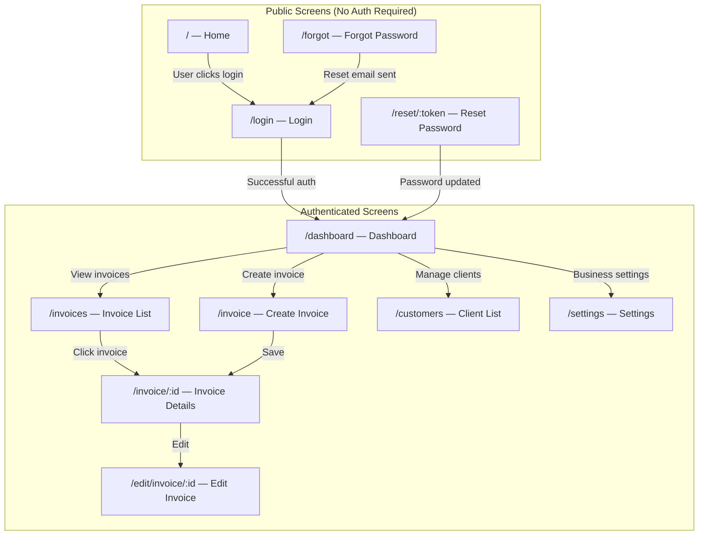

# User Journey & Screens

## Overview
This document maps every user-facing screen in the Accountill application, the user journey from first visit to completed goal, and how each screen connects to the backend.

---

## Screen Inventory

All screens are defined in `client/src/App.js:31–44` via React Router.



---

## Detailed Screen Documentation

### Screen 1: Home (`/`)
| Aspect | Details |
|---|---|
| **Component** | `client/src/components/Home/Home` |
| **Route** | `client/src/App.js:32` |
| **Purpose** | Landing page shown to all visitors |
| **Auth required** | No |
| **API calls** | None |
| **Key action** | Navigate to `/login` to get started |

### Screen 2: Login (`/login`)
| Aspect | Details |
|---|---|
| **Component** | `client/src/components/Login/Login` |
| **Route** | `client/src/App.js:37` |
| **Purpose** | User authentication — both sign in and sign up forms |
| **Auth required** | No (public entry point) |
| **API calls** | `POST /users/signin` or `POST /users/signup` |
| **Key actions** | Toggle between signin/signup; Google OAuth button |
| **Redux action** | `actions/auth.js:5` (signin), `actions/auth.js:24` (signup) |
| **On success** | `window.location.href = "/dashboard"` (full page reload) |
| **On failure** | Snackbar with error message (e.g., "User doesn't exist", "Invalid credentials") |

### Screen 3: Dashboard (`/dashboard`)
| Aspect | Details |
|---|---|
| **Component** | `client/src/components/Dashboard/Dashboard` |
| **Route** | `client/src/App.js:39` |
| **Purpose** | Overview of business metrics — total invoices, amount received, pending, payment charts |
| **Auth required** | Yes (NavBar shown only when `user` exists: `App.js:29`) |
| **API calls** | `GET /invoices?searchQuery={userId}` |
| **Charts** | ApexCharts and/or Recharts for payment history visualization |
| **Navigation** | Links to create invoice, view invoices, manage clients |

### Screen 4: Create Invoice (`/invoice`)
| Aspect | Details |
|---|---|
| **Component** | `client/src/components/Invoice/Invoice` |
| **Route** | `client/src/App.js:33` |
| **Purpose** | Form to create a new invoice with line items, client selection, VAT, currency, due date |
| **Auth required** | Yes |
| **API calls** | `POST /invoices` |
| **Initial state** | Loaded from `client/src/initialState.js:4–17` — includes random invoice number |
| **Redux action** | `actions/invoiceActions.js:42–52` (createInvoice) |
| **On success** | Redirects to `/invoice/${data._id}` via `history.push()` |

### Screen 5: Edit Invoice (`/edit/invoice/:id`)
| Aspect | Details |
|---|---|
| **Component** | `client/src/components/Invoice/Invoice` (same component as create) |
| **Route** | `client/src/App.js:34` |
| **Purpose** | Edit an existing invoice — pre-populates the form with existing data |
| **Auth required** | Yes |
| **API calls** | `GET /invoices/:id` (to load), `PATCH /invoices/:id` (to save) |
| **Redux action** | `actions/invoiceActions.js:54–63` (updateInvoice) |

### Screen 6: Invoice Details (`/invoice/:id`)
| Aspect | Details |
|---|---|
| **Component** | `client/src/components/InvoiceDetails/InvoiceDetails` |
| **Route** | `client/src/App.js:35` |
| **Purpose** | View a single invoice, send it via email, download PDF, record payments |
| **Auth required** | Yes |
| **API calls** | `GET /invoices/:id`, `POST /send-pdf`, `POST /create-pdf`, `GET /fetch-pdf`, `GET /profiles?searchQuery=` |
| **Redux action** | `actions/invoiceActions.js:27–39` (getInvoice — also fetches business profile) |
| **Key actions** | Send email, download PDF, add payment record, edit, delete |

### Screen 7: Invoice List (`/invoices`)
| Aspect | Details |
|---|---|
| **Component** | `client/src/components/Invoices/Invoices` |
| **Route** | `client/src/App.js:36` |
| **Purpose** | List all invoices belonging to the current user |
| **Auth required** | Yes |
| **API calls** | `GET /invoices?searchQuery={userId}` |
| **Redux action** | `actions/invoiceActions.js:14–24` (getInvoicesByUser) |

### Screen 8: Client List (`/customers`)
| Aspect | Details |
|---|---|
| **Component** | `client/src/components/Clients/ClientList` |
| **Route** | `client/src/App.js:40` |
| **Purpose** | Manage client/customer records — add, edit, delete |
| **Auth required** | Yes |
| **API calls** | `GET /clients/user?searchQuery=`, `POST /clients`, `PATCH /clients/:id`, `DELETE /clients/:id` |

### Screen 9: Settings (`/settings`)
| Aspect | Details |
|---|---|
| **Component** | `client/src/components/Settings/Settings` |
| **Route** | `client/src/App.js:38` |
| **Purpose** | Edit business profile — name, logo, contact info, payment details |
| **Auth required** | Yes |
| **API calls** | `GET /profiles?searchQuery=`, `PATCH /profiles/:id` |

### Screen 10: Forgot Password (`/forgot`)
| Aspect | Details |
|---|---|
| **Component** | `client/src/components/Password/Forgot` |
| **Route** | `client/src/App.js:41` |
| **Purpose** | Enter email to receive a password reset link |
| **Auth required** | No |
| **API calls** | `POST /users/forgot` |

### Screen 11: Reset Password (`/reset/:token`)
| Aspect | Details |
|---|---|
| **Component** | `client/src/components/Password/Reset` |
| **Route** | `client/src/App.js:42` |
| **Purpose** | Enter new password using the reset token from the email link |
| **Auth required** | No |
| **API calls** | `POST /users/reset` |

---

## Full User Journey: Freelancer Creates and Sends First Invoice

```mermaid
graph LR
    A["1. Visit /"] --> B["2. Click Login"]
    B --> C["3. Sign Up on /login"]
    C --> D["4. Redirected to /dashboard"]
    D --> E["5. Go to /settings"]
    E --> F["6. Fill business profile + logo"]
    F --> G["7. Go to /customers"]
    G --> H["8. Add first client"]
    H --> I["9. Go to /invoice"]
    I --> J["10. Fill invoice form"]
    J --> K["11. Save → /invoice/:id"]
    K --> L["12. Send invoice via email"]
    L --> M["13. Return to /dashboard"]
    M --> N["14. View payment status"]
```



| Step | Screen | What the User Does | What Happens in the System |
|---|---|---|---|
| 1 | `/` (Home) | Visits the app for the first time | Static landing page rendered |
| 2 | `/` → `/login` | Clicks "Login" or "Get Started" | Navigates to login page |
| 3 | `/login` | Fills signup form (name, email, password) | `POST /users/signup` → User created + Profile auto-created |
| 4 | `/dashboard` | Sees empty dashboard (no invoices yet) | `GET /invoices?searchQuery=userId` returns empty array |
| 5 | `/settings` | Navigates to settings | `GET /profiles?searchQuery=userId` loads the blank profile |
| 6 | `/settings` | Fills business name, phone, address, uploads logo | `PATCH /profiles/:id` updates the profile |
| 7 | `/customers` | Navigates to client management | `GET /clients/user?searchQuery=userId` returns empty array |
| 8 | `/customers` | Adds a new client (name, email, phone, address) | `POST /clients` creates the client record |
| 9 | `/invoice` | Navigates to create new invoice | Empty form loaded with `initialState.js` defaults |
| 10 | `/invoice` | Selects client, adds line items, sets due date, currency | Form state managed in React component |
| 11 | `/invoice/:id` | Clicks "Save" | `POST /invoices` → saves to DB → redirects to detail view |
| 12 | `/invoice/:id` | Clicks "Send Invoice" button | `POST /send-pdf` → PDF generated → emailed to client |
| 13 | `/dashboard` | Returns to dashboard | Dashboard now shows 1 invoice with pending status |
| 14 | `/dashboard` | Views charts and stats | ApexCharts/Recharts render payment history |

---

## Non-Screen Files (Not Routed)

The following component directories exist but are **not** full routed pages:

| Directory | Purpose | Type |
|---|---|---|
| `components/NavBar/` | Navigation sidebar — shown only when logged in | Layout component (rendered at `App.js:29`) |
| `components/Header/` | Top header bar | Layout component (rendered at `App.js:30`) |
| `components/Footer/` | Bottom footer | Layout component (rendered at `App.js:46`) |
| `components/Fab/` | Floating action button (likely "New Invoice") | UI widget |
| `components/Spinner/` | Loading spinner | UI widget |
| `components/Payments/` | Payment recording modal/form | Sub-component (used within InvoiceDetails) |
| `components/Icons.js` | Custom SVG icon components (4.5 KB) | Utility |
| `components/svgIcons/` | Additional SVG icon assets | Assets |

---

## NavBar Visibility Logic

The navigation bar is conditionally rendered based on authentication state:

```javascript
// client/src/App.js:23,29
const user = JSON.parse(localStorage.getItem('profile'))
// ...
{user && <NavBar />}
```

This means:
- **Not logged in**: User sees only `Header` and `Footer` — no sidebar navigation
- **Logged in**: Full `NavBar` appears with links to Dashboard, Invoices, Clients, Settings
